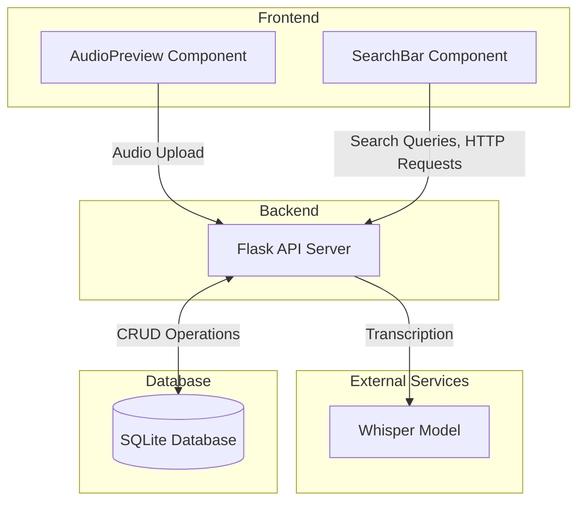

## System Architecture

### Overview
The audio-search application follows a client-server architecture with the following main components:

### Component Details

#### Frontend Layer
- **Technology**: Vue.js
- **Key Components**:
  - AudioPreview: Uploads audio files
  - SearchBar: Searches for transcriptions by file name

#### Backend Layer
- **Technology**: Flask (Python)
- **Key Components**:
  - RESTful API endpoints
  - OpenAI Whisper for transcription
- **API Endpoints**:
  - `/transcribe`: Audio file transcription
  - `/search`: Text search functionality
  - `/transcriptions`: Retrieval of stored transcriptions
  - `/delete`: Delete transcriptions

#### Database Layer
- **Technology**: SQLite
- **Schema**:
  - Transcriptions table:
    - Audio file name
    - Transcribed content
    - Timestamp of creation

#### External Services
- OpenAI Whisper (running locally)
  - Used for audio transcription
  - Base model implementation
