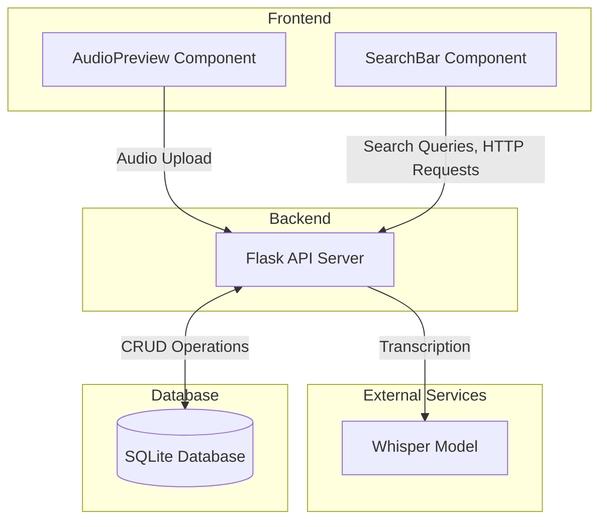

## System Architecture

### Overview
The audio-search application follows a client-server architecture with the following main components:

### Component Details

#### Frontend Layer
- **Technology**: Vue.js
- **Key Components**:
  - AudioPreview: Uploads audio files
  - SearchBar: Searches for transcriptions by file name

#### Backend Layer
- **Technology**: Flask (Python)
- **Key Components**:
  - RESTful API endpoints
  - OpenAI Whisper for transcription
- **API Endpoints**:
  - `/transcribe`: Audio file transcription
  - `/search`: Text search functionality
  - `/transcriptions`: Retrieval of stored transcriptions
  - `/delete`: Delete transcriptions

#### Database Layer
- **Technology**: SQLite
- **Schema**:
  - Transcriptions table:
    - Audio file name
    - Transcribed content
    - Timestamp of creation

#### External Services
- OpenAI Whisper 
  - Running locally in backend, used for audio transcription

### Assumptions
#### 1. Scale & Performance
- Assumes relatively small user base 
  - SQLite database is sufficient for the load
  - No need for connection pooling or load balancing due to single instance operation
  - Limited support for concurrent requests - Whisper model runs synchronously
  - No rate limiting on API endpoints
- Assumes audio files are of reasonable size
  - No chunking mechanism for large file uploads
  - No progress indicators for long-running transcriptions

#### 2. Security & Privacy
- Assumes development/testing environment
  - CORS is configured for localhost only
  - No authentication/authorization implemented
- Assumes audio content is not sensitive data
  - Transcriptions stored in plain text

#### 3. Infrastructure
- Assumes local development
  - Docker containers run on same host
  - Direct communication between services
- Assumes reliable network
  - No retry mechanisms
  - Simple error handling

#### 4. Client Environment
- Assumes desktop-first usage
  - Fixed dimensions of components
  - Limited responsive design, not designed for mobile

### Future Extensions
1. **Scalability**: 
  - Replace SQLite with PostgreSQL to support concurrency
  - Implement a job queue for transcriptions
  - Add chunking of long audio files, asynchronous transcription
2. **Security**: 
  - CORS policies implemented for frontend-backend communication, implement CSRF, authentication
  - Implement client side transcription and encryption of transcriptions when sent to backend server
3. **UI**:
  - Add responsive design

